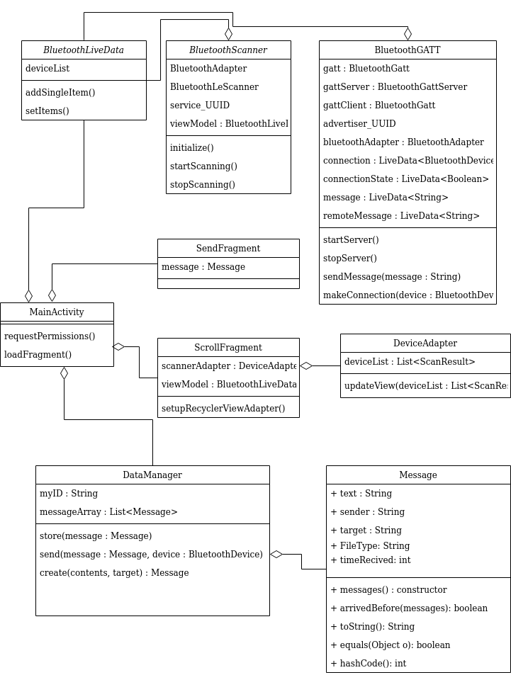

The diagram above shows the basic structure of the Bluetooth File Sharing App. The MainActivity is the main component and 
spawns all the other fragments, services, and processes. The ScrollFragment displays data from the BluetoothGATT and
BluetoothLiveData. The SendFragment creates messages and calls methods from BluetoothGATT. BluetoothLiveData gets results
from the scanner and makes it available to the rest of the app. BluetoothScanner contains code for filtered scanning for
nearby devices advertising. The BluetoothGATT is used for forming connections and passing data back and forth it also 
handles advertising. Messages class encapsulates data to be sent over bluetooth. DataManager holds functions for storing
and creating messages to be sent. 
