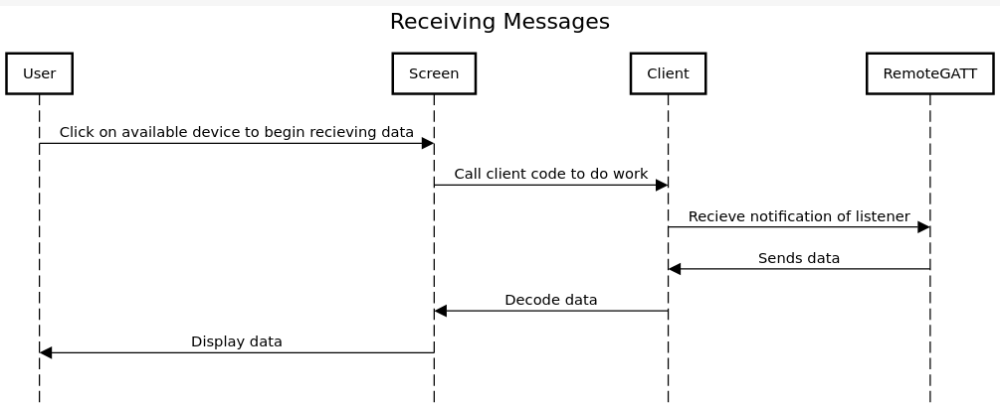
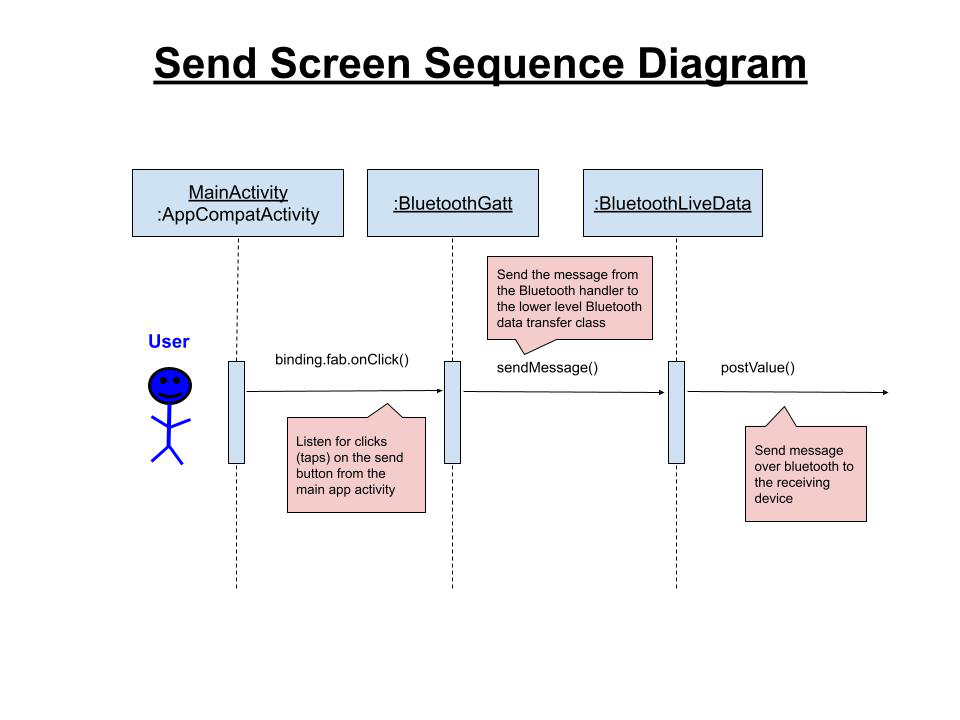

The following two sequence diagram indicate the actions the user can take in order to send and receive files and messages. 

In the first diagram the user chooses a device from a list of nearby devices to listen to. Once a device is selected the client class will form a connection and ask the device for any data it has. If the selected device has a file or some other kind of data it will be sent back over the connection formed by the client. Once the client has the data it will decode it and send it to the screen to be displayed.

The second diagram shows the process of sending data. First the user uses the send screen to add either a file or text to the message. Once the data has been added the BluetoothGATT class will advertise data for other devices to view and download.
